# Autonomous DevOps Healing Agent
🚀 Overview
This project showcases an Autonomous DevOps Healing Agent designed to automatically detect and remediate service outages in a containerized environment with zero human intervention. 
By integrating cutting-edge AI (Large Language Models) with a robust monitoring and alerting stack, it acts as a proactive Site Reliability Engineer (SRE), ensuring high availability and significantly reducing Mean Time To Recovery (MTTR) for critical web services. 

💡 The Problem It Solves
In modern microservices architectures, services can frequently experience degradation or outright crashes due to various factors like memory leaks, sudden high load, or underlying code issues. 
Manually detecting these outages, diagnosing the root cause, and initiating recovery actions is a time-consuming process, prone to human error, and directly impacts service availability. 
This project provides an automated, intelligent solution to this challenge, demonstrating true self-healing capabilities. 

🏗️ Architecture
The system is built as a multi-container Docker Compose application, orchestrating the following key components: 

webapp (Python Flask): A simple web application intentionally designed with a memory leak. This simulates real-world service degradation and crashes when subjected to sustained load. (Scaled to 3 instances for distributed testing). 
nginx (Reverse Proxy/Load Balancer): Serves as the frontend, distributing incoming traffic to the webapp instances and exposing the service to external clients. 
prometheus (Monitoring): Continuously scrapes metrics (e.g., health status, resource usage) from all webapp instances and other services. It stores this time-series data and is configured with alert rules to detect service outages. 
alertmanager (Alerting): Receives alerts from Prometheus, deduplicates, groups, and routes them to configured receivers. In this setup, it sends webhooks to the webhook-receiver. 
webhook-receiver (LLM Agent - Python Flask): This is the brain of the autonomous healing system. It's a Flask application that serves as a webhook endpoint for Alertmanager. Upon receiving an alert, it triggers an intelligent agent to diagnose and act. 
LangChain & Google Gemini API (LLM Agent Logic): The Python LLM agent utilizes the LangChain framework to orchestrate its reasoning and action-taking. It leverages the power of Google Gemini 1.5 Flash to dynamically diagnose the problem based on observed data and execute remediation steps. 
locust (Load Testing): Used to generate high concurrent load on the webapp services via nginx, simulating traffic spikes that lead to service crashes. 

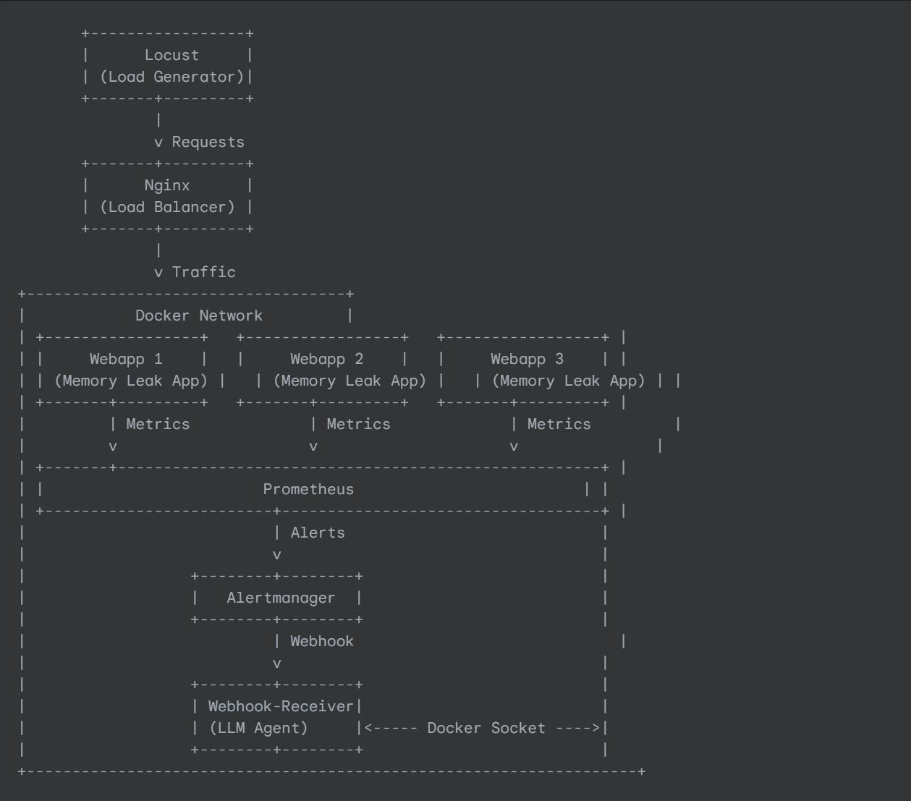 

✨ Key Features

Automated Crash Detection: Prometheus alerts are configured to detect when webapp instances become DOWN or unhealthy for a short duration. 
Dynamic LLM Diagnosis: The AI agent (using a custom list_webapp_status tool) can dynamically identify all webapp containers that are in an exited or unhealthy state, without requiring hardcoded container names. 
Autonomous Multi-Instance Restart: The LLM agent intelligently decides to use the restart_container tool to bring all affected webapp instances back online. 
Zero Human Intervention: The entire process from outage detection to recovery is fully automated. 
Scalable Solution: Designed to work with multiple, dynamically named service instances. 
Observability: Integrated Grafana dashboard for visualizing performance and health metrics. 

🚀 How It Works (The Healing Flow)

Service Degradation: Locust generates heavy, concurrent load  on the webapp services via Nginx. 
Crash Trigger: Due to the engineered memory leak in the webapp application and configured memory limits , the webapp containers hit their resource ceiling and are terminated by Docker, entering an Exited (137) state. Crucially, they do not automatically restart at this stage. 
Alerting: 
Prometheus's scrape attempts fail for the crashed webapp instances, marking them DOWN. 
An WebappInstanceDown alert fires in Prometheus, indicating a persistent outage. 
Prometheus sends this alert to Alertmanager. 
LLM Agent Trigger: Alertmanager receives the alert and, via a webhook, sends a notification to the webhook-receiver (LLM Agent) service. Alertmanager is configured with a short repeat_interval to re-notify if the problem persists. 
Autonomous Diagnosis: 
The webhook-receiver's Flask application triggers the LangChain-powered LLM agent. 
The LLM agent's prompt guides it to first confirm the overall webapp health (which will be down). 
It then uses the list_webapp_status tool to get a dynamic list of all devopsagent-webapp-X containers and their exact Docker statuses. 
Autonomous Remediation: 
Based on the tool's output, the LLM intelligently identifies all exited or unhealthy webapp instances. 
For each identified instance, it invokes the restart_container tool with the specific container name. This tool interacts directly with the Docker daemon to bring the container back online. 
Verification: After attempting restarts for all identified down containers, the LLM agent uses check_webapp_health again to confirm that the overall webapp frontend is back online, completing its healing cycle. 
Continuous Monitoring: If the webapp continues to crash due to sustained Locust load, the entire cycle repeats, demonstrating continuous self-healing capabilities. 

🛠️ Technologies Used
Containerization: Docker, Docker Compose 
Language: Python (Flask, docker SDK, requests, prometheus_client) 
LLM Framework: LangChain 
Generative AI: Google Gemini API (gemini-1.5-flash) 
Monitoring: Prometheus 
Alerting: Alertmanager 
Dashboarding: Grafana 
Load Testing: Locust 
Web Server/Proxy: Nginx 

# DEMONSTARTION AND TESTING

Healthy webapp logs 
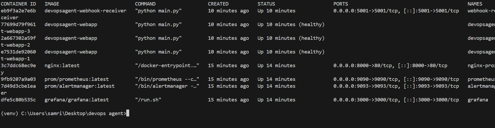

Prometheus in inactive state 
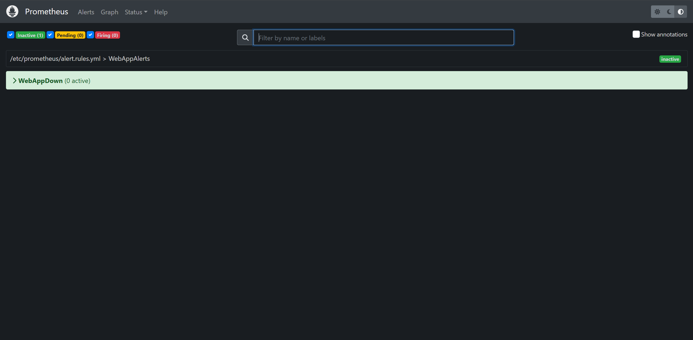

Alertmanager with no alerts 
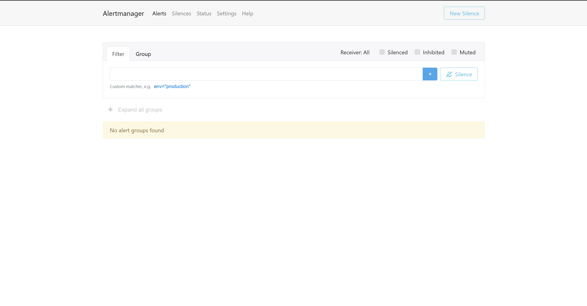

Active webapp 
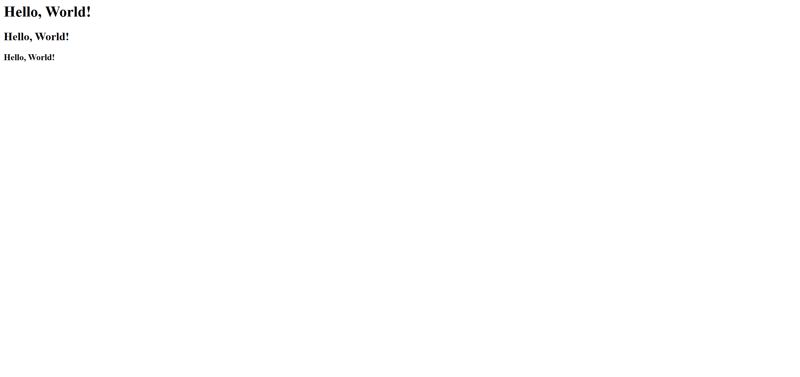

Locust 
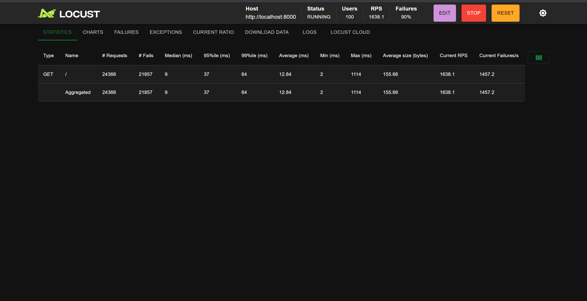

Unhealthy webapp logs 
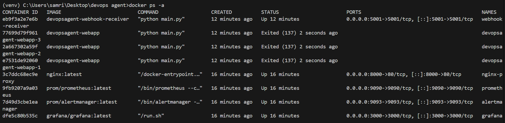

Inactive webapp 
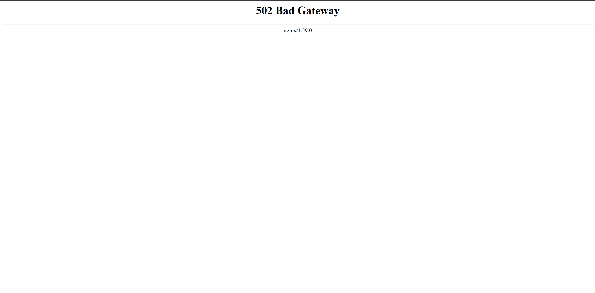

Prometheus firing 
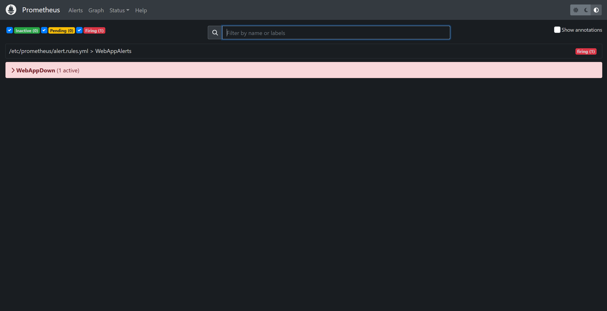

Alertmanager active 
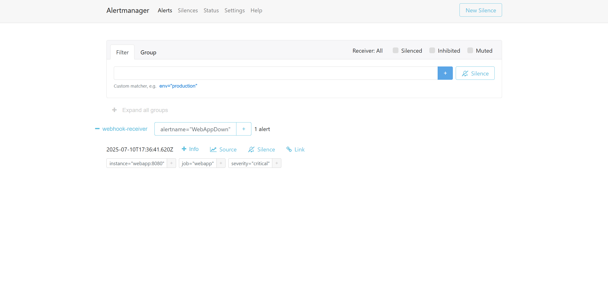

LLM logs 
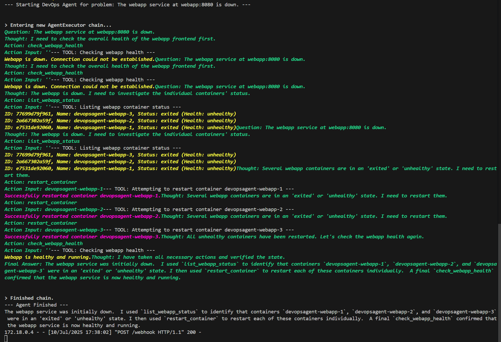

Webapp restored logs 
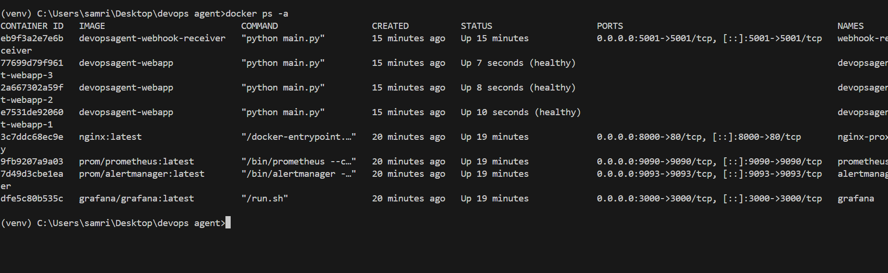

Graffana dashboard 
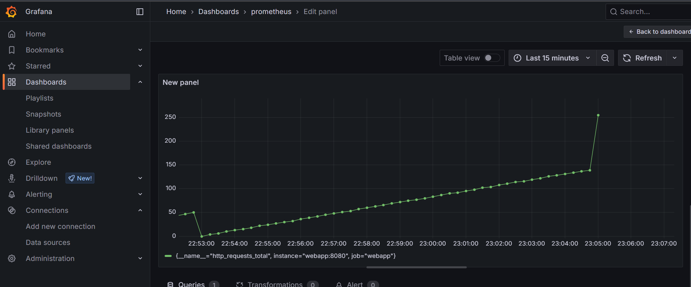

# 🚀 Setup & Running Locally
Prerequisites 
Docker Desktop (with Docker Engine running) 
Git 
Python 3.9+ 
A Google Cloud Project with the Generative Language API enabled and a valid API Key (ensure sufficient quota for testing). 

Quick Start 
Clone the repository: 

git clone https://github.com/Samridh-Minocha007/autonomous-devops-agent.git 
cd autonomous-devops-agent 

Configure Environment Variables: 
Create a .env file in the root of the project directory (same level as docker-compose.yaml). 
Add your Google Gemini API Key to it: 

GEMINI_API_KEY=YOUR_GENERATED_GEMINI_API_KEY 

Start the Autonomous Agent Stack: 
This command will build your custom webapp and webhook-receiver images, download other services, and start everything. It will scale webapp to 3 instances. 

docker compose up --build --scale webapp=3 -d 

Verify all containers are running and healthy initially: 

docker ps 

You should see nginx-proxy, webhook-receiver, prometheus, grafana, alertmanager, and three devopsagent-webapp-X containers, with webapp instances showing healthy. 

# 📅 Author
Samridh Minocha 
📧 samridhminocha2005@gmail.com

